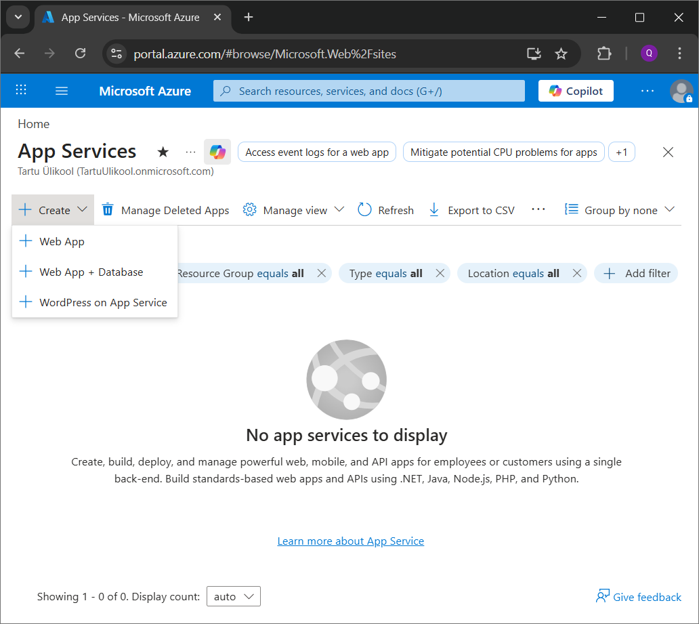

# User comments

This Markdown file is for coding agents to read-only. Coding agents may not write in or modify the contents of this file.

Sub-headings denote the approximate Unix timestamps the comments were authored.

The user comments are in descending order, so more recent comments are nearer to the top.

Note to self:

``` powershell
[DateTimeOffset]::UtcNow.ToUnixTimeSeconds()
```

---

## 1776954837

- [] Checked by user

### `practice-10\README.md`

> 3. Inside `lab10`, create:
>    - an **App Service (Linux, Python 3.9)** — Free F1 tier.
>    - a **Storage Account** → add a **Blob container** named `images`.
>    - a **Cosmos DB account** (Core/SQL) → add database `lab5messagesdb` → container `lab5messages` (partition key `/id`, throughput 400).

1. Request coding agent to provide additional details in `practice-10\README.md` (as well as other `practice-x\README.md` Markdown documents), to minimize ambiguities in implementation by user. (See below attached image)



2. Request coding agent to commit and push the local repository to remote. (Every file in the repository should be committed and pushed, exclude files only in coding agent’s best judgement.)

---

## 1776837718

- [x] Checked by user

### `practice-x\README.md`

1. Remove all instances of `li_qun_yan@outlook.com` (that email is not used anywhere in this course). The university email account is `qun.yan.li@ut.ee`.

2. Substitute all instances of Azure region: `North Europe` with Azure region: `Sweden Central`, because `North Europe` Azure region doesn’t work for my Azure account, but `Sweden Central` does.

3. Request coding agent to commit and push the local repository to remote. (Every file in the repository should be committed and pushed, exclude files only in coding agent’s best judgement.)

---

## 1776835422

- [x] Checked by user

1. Request coding agent to compare the updated `common\README.md` with the current state of the `practice-x\README.md` documents, and update the `practice-x\README.md` documents as needed.

2. Request coding agent to commit and push the local repository to remote. (Every file in the repository should be committed and pushed, exclude files only in coding agent’s best judgement.)

---

## 1776834917

- [x] Checked by user

### `common\README.md`

Add five more comments in the Markdown file (file and comments should be re-written, re-organized, and re-worded by the coding agent in its best judgement):

* The user intends to complete all bonus credit tasks.

* If the course Practical webpage does not prescribe deliverable file names, coding agent should recommend a file name.

* In each Practical `README.md` file, at the end of each Exercise in each Practical, coding agent should list the deliverables needed before continuing to the next Exercise.

* In each Practical `README.md` file, at the end of each Practical, coding agent should list the deliverables needed for final checks before submission.

* If the course Practical requires written answers/responses from the student, the answer/response should be in clear B1-level English, with short easy-to-follow sentences, the technical terminology of cloud computing technologies, and in mostly third person passive voice.
